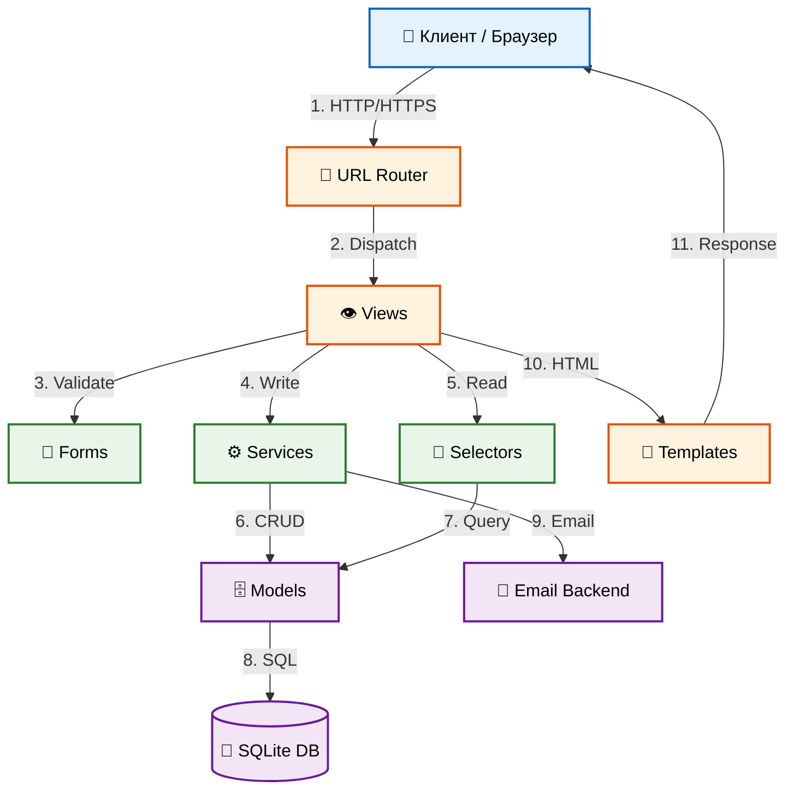

# 🚀 DZ19: Система регистрации и аутентификации для интернет-магазина

**Автор:** Виктор Куличенко | Специалист по ИБ и AI-архитектуре  
**Репозиторий:** [VictorKVS/DZ19_Getting_Started_with_Models](https://github.com/VictorKVS/DZ19_Getting_Started_with_Models)  
**Статус:** 🚧 В разработке (IDC-Lite)  
**Тема:** ORBITA PRIME — премиальный магазин космического туризма

---

## 📋 1. Условие задачи (ТЗ)

**Цель:** Реализовать систему регистрации, входа и управления пользователями для интернет-магазина с подтверждением email и интеграцией корзины.

### Этапы выполнения:

#### Часть 1: Кастомная модель пользователя
- [ ] Расширение стандартной модели Django (`AbstractBaseUser` + `BaseUserManager`)
- [ ] Дополнительные поля: телефон, адрес, подтверждение email
- [ ] Email как основной идентификатор (вместо username)

#### Часть 2: Регистрация и вход
- [ ] Форма регистрации с валидацией email (уникальность, формат)
- [ ] Механизм подтверждения email (токен + ссылка)
- [ ] Форма входа (только после подтверждения email)
- [ ] Сброс пароля через email

#### Часть 3: Личный кабинет
- [ ] Просмотр/редактирование профиля (телефон, адрес)
- [ ] История заказов
- [ ] Изменение пароля
- [ ] Удаление аккаунта (с подтверждением через email)

#### Часть 4: Интеграция с корзиной
- [ ] Сессионная корзина для анонимов
- [ ] Перенос корзины при авторизации
- [ ] Сохранение незавершённых заказов

#### ИБ-требования (Senior-уровень):
- [ ] Согласие на обработку ПДн (152-ФЗ) с фиксацией IP и даты
- [ ] Защита от brute-force (rate limiting)
- [ ] Аудит критичных действий (логирование)
- [ ] Хеширование паролей (PBKDF2/Argon2)

---

## 🏛️ 2. Архитектура (C4 Model)


Принцип Agent-Ready (CQRS-lite):
Services Layer — бизнес-логика (запись)
Selectors Layer — чтение данных (оптимизированные запросы)
Views Layer — тонкие HTTP-обёртки

🧪 3. Тестирование (TDD)
Планируется: 10+ тестов (Forms + Services + Views)
Покрытие: ≥80%
Методология: Test-Driven Development

📂 4. Структура проекта

```text
DZ19/
│
├── 📄 manage.py                    # Точка входа Django, запуск CLI-команд
├── 📄 requirements.txt             # Зависимости: django, python-dotenv
├── 📄 README.md                    # Документация проекта (ТЗ, архитектура, запуск)
├── 📄 .gitignore                   # Исключения для Git (venv/, db.sqlite3, __pycache__)
├── 📄 .env.example                 # Шаблон переменных окружения (SECRET_KEY, DEBUG)
├── 📄 pyproject.toml               # Конфигурация pytest, black, isort
│
├── 📁 config/                      # ⚙️ Настройки проекта
│   ├── __init__.py                 # Маркер Python-пакета
│   ├── settings.py                 # AUTH_USER_MODEL, security headers, logging, email
│   ├── urls.py                     # Главный роутер: admin/, accounts/, cart/
│   ├── wsgi.py                     # WSGI-интерфейс для production-серверов
│   └── asgi.py                     # ASGI-интерфейс для async (WebSocket в будущем)
│
├── 📁 accounts/                    # 👤 Аутентификация (1-й в INSTALLED_APPS)
│   ├── __init__.py                 # Маркер Python-пакета
│   ├── apps.py                     # AppConfig: verbose_name='🚀 Управление пользователями'
│   ├── models.py                   # CustomUser: email, phone, address, pd_consent (152-ФЗ)
│   ├── managers.py                 # CustomUserManager: create_user, create_superuser
│   ├── forms.py                    # CustomUserCreationForm, CustomAuthenticationForm
│   ├── services.py                 # UserService: создание, активация, отправка email
│   ├── selectors.py                # get_user_by_email, get_user_by_id (read-only)
│   ├── views.py                    # register, activate, login, logout, profile
│   ├── urls.py                     # app_name='accounts': /register/, /login/, /profile/
│   ├── admin.py                    # Регистрация CustomUser в Django Admin
│   ├── validators.py               # Проверка сложности пароля (12+ символов)
│   ├── tokens.py                   # Кастомные токены активации с TTL
│   ├── utils.py                    # get_client_ip() — извлечение IP из request
│   ├── tests/                      # 🧪 Тесты модуля accounts
│   │   ├── __init__.py
│   │   ├── test_models.py          # T-ACC-01..08: модель CustomUser
│   │   ├── test_views.py           # T-ACC-05..07: HTTP-эндпоинты
│   │   └── test_security.py        # T-SEC-01..02: ИБ-требования
│   └── migrations/                 # 📦 Миграции БД
│       └── __init__.py
│
├── 📁 cart/                        # 🛒 Корзина покупок
│   ├── __init__.py                 # Маркер Python-пакета
│   ├── apps.py                     # AppConfig: verbose_name='🛒 Корзина'
│   ├── models.py                   # Cart (OneToOne User), CartItem (FK Cart)
│   ├── services.py                 # CartService: add, remove, clear
│   ├── selectors.py                # get_user_cart, get_cart_total
│   ├── views.py                    # view_cart, add_to_cart, remove_from_cart
│   ├── urls.py                     # app_name='cart': /cart/, /add/, /remove/
│   ├── utils.py                    # merge_session_cart() — перенос из сессии в БД
│   ├── session.py                  # Работа с сессионной корзиной анонима
│   ├── admin.py                    # Регистрация Cart/CartItem в админке
│   ├── tests/                      # 🧪 Тесты модуля cart
│   │   ├── __init__.py
│   │   └── test_utils.py           # T-CART-01..02: слияние корзин
│   └── migrations/                 # 📦 Миграции БД
│       └── __init__.py
│
├── 📁 templates/                   # 🎨 HTML-шаблоны (космический стиль)
│   ├── base.html                   # Базовый каркас: navbar, footer, Bootstrap 5
│   ├── home.html                   # Главная страница (лендинг ORBITA PRIME)
│   ├── accounts/                   # Шаблоны аутентификации
│   │   ├── register.html           # "Подача заявки на орбитальный полёт"
│   │   ├── login.html              # "Вход для своих"
│   │   ├── profile.html            # "Досье космонавта"
│   │   ├── password_reset.html     # "Восстановление доступа"
│   │   └── delete_account.html     # "Аннулирование допуска"
│   ├── cart/                       # Шаблоны корзины
│   │   └── cart.html               # "Манифест полёта"
│   └── legal/                      # Юридические страницы (152-ФЗ)
│       ├── privacy_policy.html     # Политика конфиденциальности
│       └── user_agreement.html     # Пользовательское соглашение
│
├── 📁 static/                      # 🎭 Статические ресурсы
│   ├── css/
│   │   └── space-theme.css         # Космическая тема (glassmorphism, градиенты)
│   ├── js/
│   │   └── cart.js                 # Динамика корзины (AJAX)
│   └── images/
│       ├── logo.svg                # Логотип ORBITA PRIME
│       └── hero-bg.jpg             # Фон главной страницы (космос)
│
└── 📁 media/                       # 📸 Загружаемые файлы (игнорируется в Git)
    ├── products/                   # Изображения товаров
    └── avatars/                    # Аватарки пользователей

🚀 5. Инструкция по запуску

# 1. Клонировать (или перейти в папку проекта)
cd DZ19

# 2. Виртуальное окружение
python -m venv venv
venv\Scripts\activate  # Для Windows
# source venv/bin/activate # Для Linux/Mac

# 3. Зависимости
pip install django python-dotenv

# 4. Миграции (создаст таблицу CustomUser)
python manage.py makemigrations
python manage.py migrate

# 5. Суперпользователь (будет запрашивать Email, а не Username)
python manage.py createsuperuser

# 6. Запуск
python manage.py runserver

✅ 7. Чек-лист соответствия ТЗ
Кастомная модель (email, phone, address)
Подтверждение email (токен + ссылка)
Форма регистрации с валидацией уникальности email
Вход только после активации аккаунта
Сброс пароля через email
Личный кабинет (просмотр профиля)
Удаление аккаунта (с подтверждением)
Согласие на ПДн (152-ФЗ) с фиксацией IP
Корзина анонима в сессии
Перенос корзины в БД при логине
Логирование аудита (INFO/WARNING)

🏭 6. Промышленный цикл разработки (IDC)

┌─────────────────────────────────────────────────────────────┐
│  ШАГ 1: ПОСТАНОВКА ЗАДАЧИ  ✅ Завершена (этот README)       │
│  ШАГ 2: АРХИТЕКТУРА         ✅ Завершена (схема выше)       │
│  ШАГ 3: ТЕСТ-КОНТРАКТ       ⏳ В процессе                   │
│  ШАГ 4: РЕАЛИЗАЦИЯ          ⏳ В процессе                   │
│  ШАГ 5: ТЕСТЫ               ⏳ Ожидает                      │
│  ШАГ 6: DEVSECOPS           ⏸️ Опционально                  │
└─────────────────────────────────────────────────────────────┘

✅ 7. Чек-лист соответствия ТЗ
Кастомная модель (email, phone, address)
Подтверждение email (токен + ссылка)
Форма регистрации с валидацией
Вход только после активации
Сброс пароля
Личный кабинет (профиль, история)
Удаление аккаунта
Согласие на ПДн (152-ФЗ)
Корзина анонима в сессии
Перенос корзины при логине
Логирование аудита
Статус: 🚧 В активной разработке
Версия: 0.1.0-alpha


---

## 🗺️ ШАГ 2: План файлов (что будем делать дальше)

| № | Файл | Задача | Статус |
|---|------|--------|:------:|
| 1 | `config/settings.py` | Настройки + AUTH_USER_MODEL + логирование | ⏳ |
| 2 | `config/urls.py` | Главный роутер | ⏳ |
| 3 | `accounts/managers.py` | CustomUserManager (создание пользователей) | ⏳ |
| 4 | `accounts/models.py` | CustomUser + 152-ФЗ поля | ⏳ |
| 5 | `accounts/forms.py` | Формы регистрации/входа с валидацией | ⏳ |
| 6 | `accounts/services.py` | UserService (бизнес-логика) | ⏳ |
| 7 | `accounts/views.py` | HTTP-обёртки (register, login, activate, profile) | ⏳ |
| 8 | `accounts/urls.py` | Маршруты | ⏳ |
| 9 | `cart/models.py` | Cart + CartItem | ⏳ |
| 10 | `cart/utils.py` | merge_session_cart | ⏳ |
| 11 | `templates/base.html` | Космический каркас (Bootstrap 5) | ⏳ |
| 12 | `templates/accounts/*.html` | Шаблоны регистрации/входа/профиля | ⏳ |

---

## 🎯 Что делаем прямо сейчас?

**Скажите "ДА, начинаем с файла №1"** — и я дам:
1. **Полный путь** к файлу
2. **Задачу** (что он должен делать)
3. **Схему взаимодействия** (откуда берёт, куда передаёт)
4. **Код** с IDC-комментариями
5. **Построчное объяснение** (учебное пособие)

Пойдём по порядку: `settings.py` → `urls.py` → `managers.py` → ... → `templates/`.

**Готовы?** Жду команду "ДА"! 🚀

